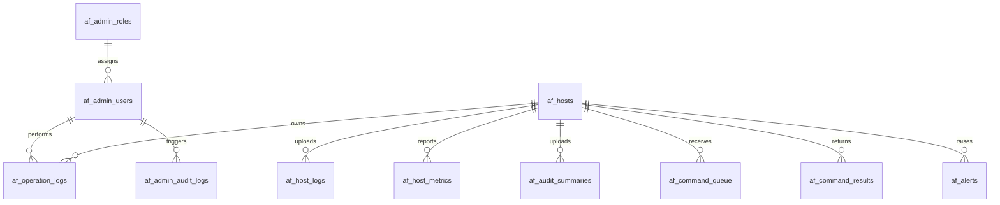

# AuditForwarder 服务端关系型数据库设计

本文档定义服务端关系型数据库方案，覆盖主机信息管理、操作日志管理、管理员账号管理、权限控制、审计追踪、备份恢复和 API 映射关系。

## 1. 技术选型

数据库管理系统选用 PostgreSQL 15 或更高版本。

选择原因：

- 支持标准事务和 ACID，适合主机注册、命令下发、日志入库等一致性要求较高的场景。
- 支持 `JSONB`，可保存硬件配置、权限列表、操作详情等半结构化字段，同时保留关系型约束。
- 支持丰富索引，包括 B-Tree、GIN 和时间范围查询优化。
- 支持 `pg_dump`、WAL 归档、流复制等成熟备份恢复能力。
- 支持 `pgcrypto` 扩展，可生成 UUID 并辅助密码哈希存储。

## 2. 关系模型

## 3. 表结构说明

### 3.1 管理员角色表 `af_admin_roles`

| 字段 | 类型 | 说明 |
| --- | --- | --- |
| `role_id` | `smallserial` | 角色主键 |
| `role_code` | `varchar(64)` | 角色编码，例如 `admin`、`auditor` |
| `role_name` | `varchar(128)` | 角色名称 |
| `permission_level` | `integer` | 权限等级，数值越大权限越高 |
| `permissions` | `jsonb` | 权限点数组，例如 `["hosts:read", "logs:read"]` |
| `created_at` | `timestamptz` | 创建时间 |

### 3.2 管理员账号表 `af_admin_users`

| 字段 | 类型 | 说明 |
| --- | --- | --- |
| `user_id` | `uuid` | 管理员唯一 ID |
| `username` | `varchar(64)` | 登录用户名，大小写不敏感唯一 |
| `password_hash` | `text` | 不可逆密码哈希，推荐 Argon2id 或 bcrypt |
| `password_algorithm` | `varchar(32)` | 哈希算法标识 |
| `role_id` | `smallint` | 关联角色 |
| `permission_level` | `integer` | 用户权限等级，可低于角色默认值 |
| `account_status` | `varchar(16)` | `active`、`disabled`、`locked` |
| `created_at` | `timestamptz` | 创建时间 |
| `last_login_at` | `timestamptz` | 最近登录时间 |
| `updated_at` | `timestamptz` | 更新时间 |

安全要求：

- 不保存明文密码。
- 生产环境推荐使用 Argon2id：内存成本不低于 64MB，迭代次数不低于 3。
- 登录失败次数和锁定策略可在服务层实现，并写入 `af_admin_audit_logs`。

### 3.3 主机信息表 `af_hosts`

| 字段 | 类型 | 说明 |
| --- | --- | --- |
| `host_id` | `varchar(80)` | 主机唯一标识，例如 `test-agent-001` 或 `host-xxxxxxxxxxxxxxxx` |
| `ip_address` | `inet` | 主机 IP 地址 |
| `port` | `integer` | 主机服务端口，范围 0-65535 |
| `host_name` | `varchar(128)` | 主机名称 |
| `os_type` | `varchar(64)` | 操作系统类型，例如 `Windows`、`Linux` |
| `os_version` | `varchar(256)` | 操作系统版本 |
| `hardware_info` | `jsonb` | 硬件信息，如 CPU 线程数、内存、磁盘 |
| `network_status` | `varchar(16)` | `online`、`offline`、`unknown` |
| `registered_at` | `timestamptz` | 注册时间 |
| `last_seen_at` | `timestamptz` | 最后在线时间 |
| `cpu_usage_percent` | `numeric(5,2)` | 最近一次 CPU 使用率 |
| `memory_usage_percent` | `numeric(5,2)` | 最近一次内存使用率 |
| `permissions` | `jsonb` | 该主机允许执行的远控命令 |
| `note` | `text` | 备注 |
| `created_at` | `timestamptz` | 创建时间 |
| `updated_at` | `timestamptz` | 更新时间 |

一致性规则：

- `host_id` 是主键，所有指标、日志、命令结果都通过它关联主机。
- `network_status` 使用检查约束限制枚举值。
- 删除主机默认限制删除，避免误删历史日志；如需归档删除，应先迁移历史数据。

### 3.4 主机上传日志表 `af_host_logs`

| 字段 | 类型 | 说明 |
| --- | --- | --- |
| `log_id` | `bigserial` | 日志 ID |
| `host_id` | `varchar(80)` | 关联主机 |
| `log_type` | `varchar(64)` | 日志类型，例如 `system`、`security`、`application` |
| `log_content` | `text` | 原始日志内容或规范化后的日志正文 |
| `generated_at` | `timestamptz` | 日志在主机上生成的时间 |
| `uploaded_at` | `timestamptz` | 服务端接收日志的时间 |
| `log_status` | `varchar(16)` | `new`、`parsed`、`alerted`、`archived` |
| `metadata` | `jsonb` | 扩展元数据，例如来源文件、事件 ID、采集器名称 |

一致性规则：

- `host_id` 外键引用 `af_hosts(host_id)`，确保日志必须属于已注册主机。
- `log_type` 和 `log_content` 不允许为空。
- 删除主机默认受限，防止误删关联日志。

### 3.5 操作日志表 `af_operation_logs`

| 字段 | 类型 | 说明 |
| --- | --- | --- |
| `log_id` | `bigserial` | 日志 ID |
| `host_id` | `varchar(80)` | 关联主机 |
| `user_id` | `uuid` | 关联管理员账号，可为空 |
| `actor` | `varchar(128)` | 操作执行者，兼容 Agent 上传的用户字段 |
| `operation_type` | `varchar(64)` | 操作类型，例如 `execute`、`file`、`login` |
| `operation_time` | `timestamptz` | 操作发生时间 |
| `operation_detail` | `jsonb` | 操作详情 |
| `result_status` | `varchar(16)` | `success`、`failure`、`unknown` |
| `error_message` | `text` | 错误信息 |
| `created_at` | `timestamptz` | 入库时间 |

查询能力：

- 按主机、用户、时间范围、操作类型、结果状态筛选。
- `operation_detail` 使用 GIN 索引支持 JSON 字段检索。
- 导出时建议按时间分页，避免一次性导出过大结果集。

### 3.6 扩展业务表

| 表名 | 用途 |
| --- | --- |
| `af_host_logs` | 保存主机上传的原始或规范化日志数据 |
| `af_host_metrics` | 保存 CPU、内存、磁盘、网络指标历史 |
| `af_audit_summaries` | 保存 Agent 上传的审计批次摘要和 Merkle Root |
| `af_command_queue` | 保存服务端下发给主机的远控命令队列 |
| `af_command_results` | 保存客户端回传的命令执行结果 |
| `af_alerts` | 保存违规检测和阈值告警 |
| `af_admin_audit_logs` | 保存管理员登录、改密、授权、删除等敏感操作审计记录 |

## 4. 索引设计

核心索引：

- `af_hosts(network_status, last_seen_at desc)`：优化在线主机列表和状态页。
- `af_host_logs(host_id, generated_at desc)`：优化按主机查看上传日志。
- `af_host_logs(log_type, generated_at desc)`：优化按日志类型筛选。
- `af_host_logs using gin(metadata)`：优化日志扩展字段检索。
- `af_operation_logs(host_id, operation_time desc)`：优化按主机查看日志。
- `af_operation_logs(user_id, operation_time desc)`：优化按管理员追踪操作。
- `af_operation_logs(operation_type, operation_time desc)`：优化日志分类查询。
- `af_operation_logs using gin(operation_detail)`：优化详情字段检索。
- `af_host_metrics(host_id, metric_time desc)`：优化资源历史曲线。
- `af_command_queue(host_id, command_status, created_at)`：优化 Agent 拉取待执行命令。

## 5. 权限控制模型

系统采用角色 + 权限点模型：

| 角色 | 权限等级 | 典型权限 |
| --- | --- | --- |
| `admin` | 100 | 所有管理权限 |
| `operator` | 60 | 主机查看、远程控制、日志查看 |
| `auditor` | 40 | 日志、告警、审计记录只读 |

权限点示例：

- `hosts:read`
- `hosts:write`
- `logs:read`
- `logs:export`
- `commands:send`
- `admins:manage`
- `audit:read`

服务端 API 在处理请求时应先完成身份认证，再根据权限点判断是否允许访问。

## 6. 事务与一致性

建议事务边界：

- 主机注册或心跳：更新 `af_hosts`，必要时写入管理员审计或系统审计，使用单事务。
- 远程命令下发：校验主机存在、校验权限、写入 `af_command_queue`，使用单事务。
- 命令结果回传：更新命令状态、写入 `af_command_results`，使用单事务。
- 管理员改密：更新密码哈希、写入 `af_admin_audit_logs`，使用单事务。

## 7. 备份与恢复策略

开发环境：

- 每日执行一次 `pg_dump` 逻辑备份。
- 保留最近 7 天备份。

生产环境：

- 每日全量逻辑备份。
- 开启 WAL 归档，用于时间点恢复。
- 至少保留 30 天备份。
- 定期执行恢复演练，确认备份文件可用。

脚本位置：

- 创建表结构：`scripts/database/postgresql/001_schema.sql`
- 初始化基础数据：`scripts/database/postgresql/002_seed.sql`
- 备份恢复脚本：`scripts/database/postgresql/backup_restore.ps1`

## 8. 与现有服务端 API 的映射

| 当前 API | 数据库表 |
| --- | --- |
| `GET /hosts` | `af_hosts` |
| `POST /hosts` | `af_hosts` |
| `PUT /hosts?id=<host_id>` | `af_hosts` |
| `DELETE /hosts?id=<host_id>` | `af_hosts` |
| `POST /hosts/heartbeat` | `af_hosts`、`af_host_metrics` |
| `POST /agent/metrics` | `af_host_metrics`、`af_alerts` |
| `POST /agent/audit-summaries` | `af_audit_summaries` |
| `POST /agent/operation-logs` | `af_operation_logs`、`af_alerts` |
| `POST /agent/logs` | `af_host_logs` |
| `GET /logs/query` | `af_operation_logs` |
| `GET /logs/analytics` | `af_operation_logs`、`af_alerts` |
| `POST /remote/control` | `af_command_queue` |
| `GET /hosts/commands` | `af_command_queue` |
| `POST /hosts/command-results` | `af_command_results` |
| `GET /rbac/policy` | `af_admin_roles`、`af_admin_users` |
